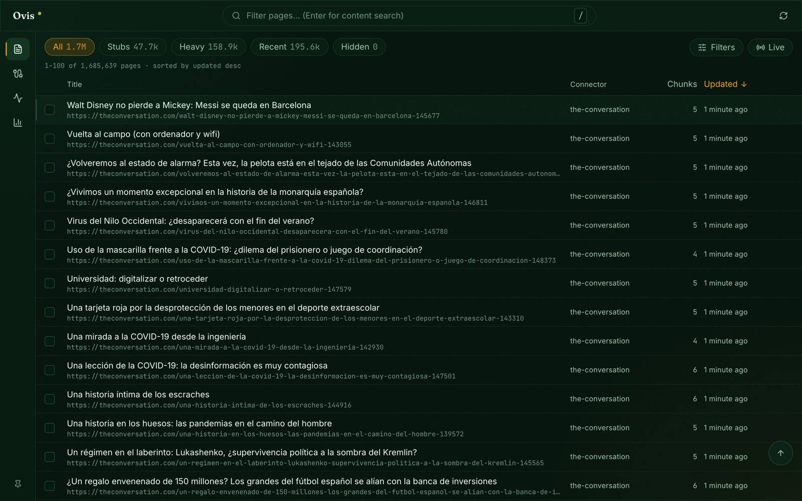
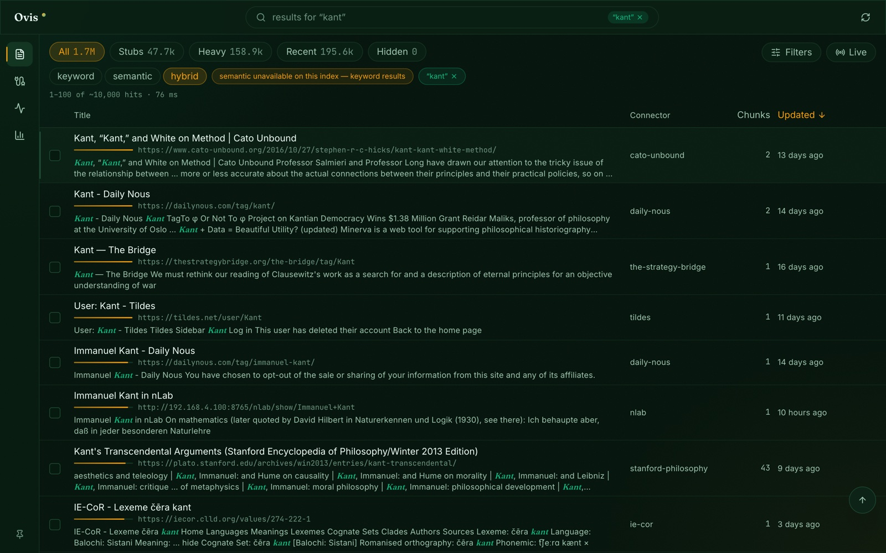
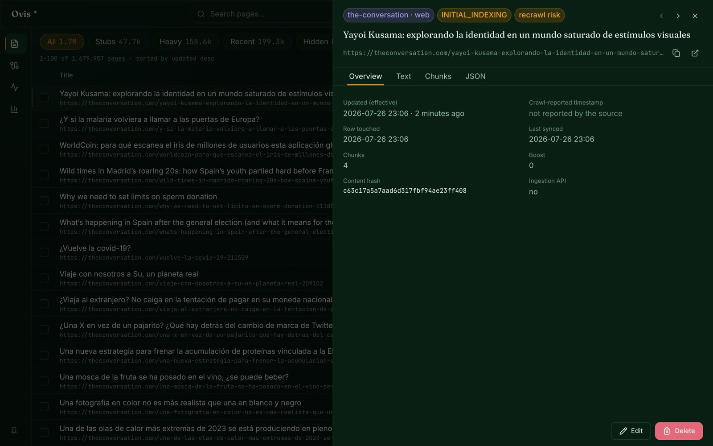
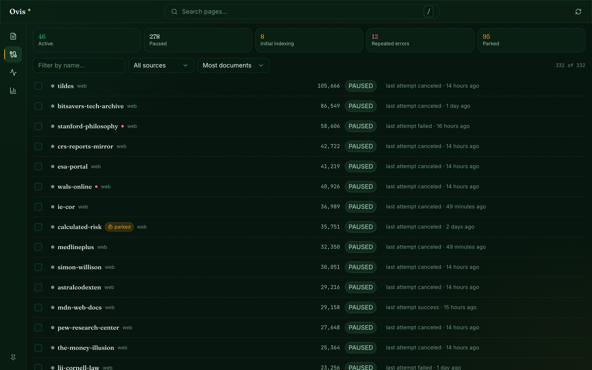
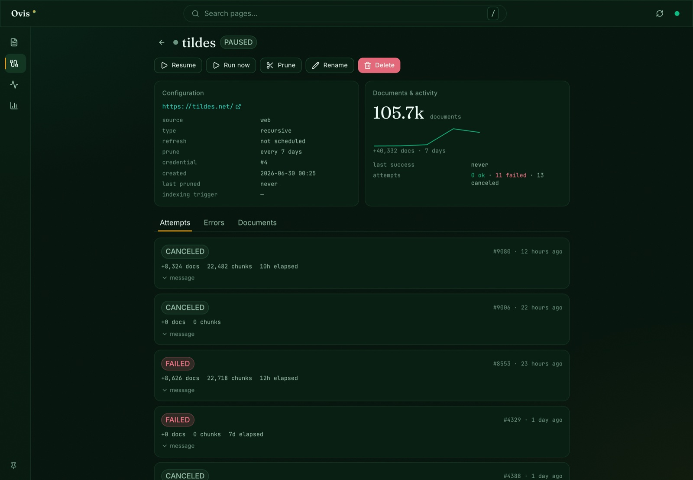
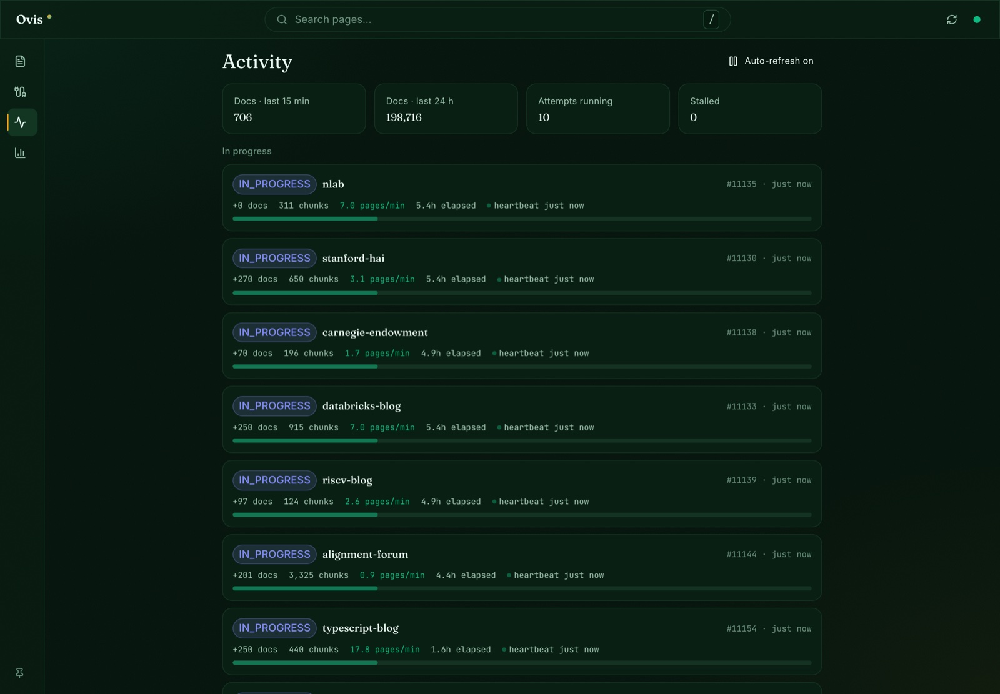
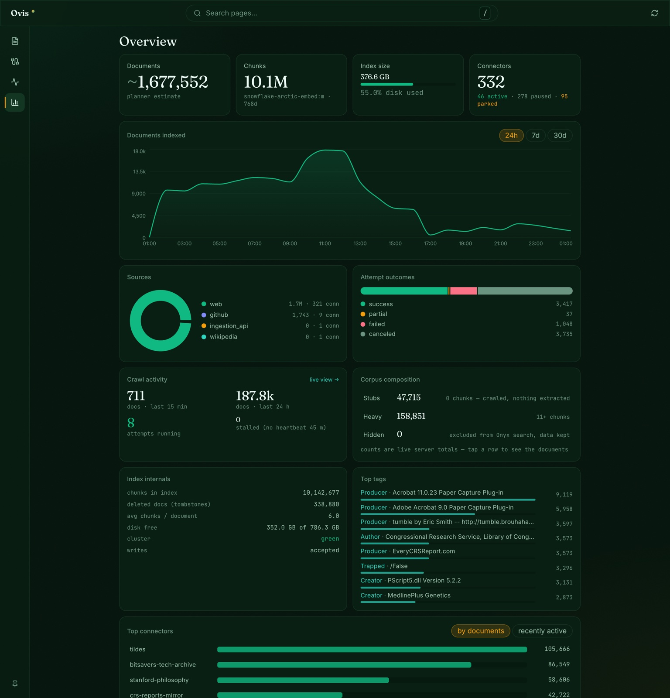
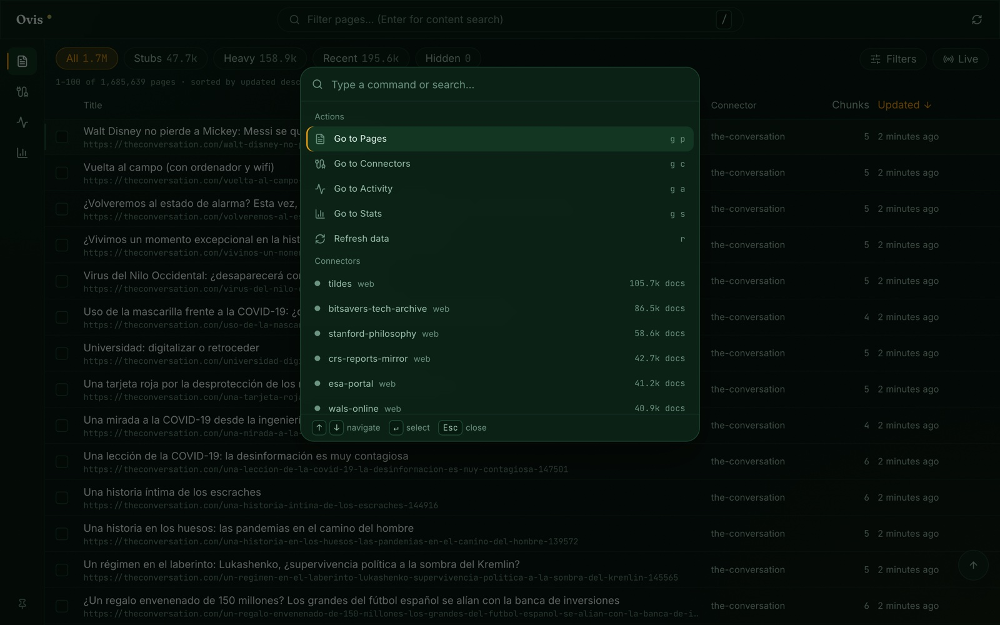
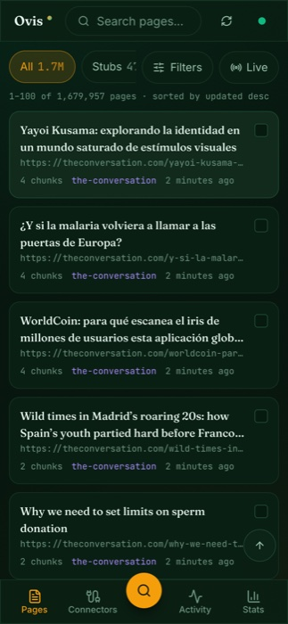

<div align="center">

# 🐏 OVIS

**See everything your Onyx deployment crawled**

*A single-binary observability and control plane for
[Onyx](https://github.com/onyx-dot-app/onyx) page stores*

[](https://github.com/arvarik/ovis/actions/workflows/docker.yml)
[](LICENSE)
[](https://github.com/arvarik/ovis/pkgs/container/ovis)

</div>



Onyx crawls and answers, but its raw page store is
effectively invisible. You can't easily see what it holds, why a connector
stopped, whether that delete actually stuck, or what a document really looks
like inside the index. 

**OVIS** is
a fast web dashboard, a scriptable CLI, and an honest HTTP API, all shipped as
one Rust binary.

## Why OVIS

- ⚡ **Fast by architecture, not by cache.** Listing rides Postgres alone
  (zero OpenSearch calls on the hot path), keyset cursors paginate 1.7M rows
  with no depth limit, and the p50 list page is **10.5 ms** — enforced by a
  benchmark gate, not a promise.
- 🔎 **Real content search.** BM25 with highlighted snippets today;
  semantic/hybrid wired and self-detecting — the moment your index has a
  populated kNN field, vector search turns on with no code change. Until
  then, responses *say* they degraded rather than quietly serving less.
- 🎛️ **Fleet controls with guardrails.** Pause, resume, run-once, prune,
  rename, targeted reindex, delete — proxied through the Onyx API, never
  written behind its back. Deleting a connector means typing its exact name.
  There is deliberately no bulk crawl trigger.
- 📈 **Live crawl telemetry.** Running attempts with heartbeats, pages/min and
  batch progress; *queued* is labeled queued, and *stalled* means no heartbeat
  for 45 minutes — never guessed from document counts.
- ✂️ **Review-first pruning, at corpus scale.** Checkpointed scans find
  duplicates (exact, MinHash and canonical-URL), stubs, assets indexed as
  pages, low-quality text and rule-matched junk — as *candidates* with
  per-document evidence, never as deletions. Acting means staging (reversible
  `hidden`, Onyx-synced); only a rate-limited background reaper ever deletes,
  after a grace period, and recrawled documents are auto-staged again rather
  than silently returning. See [docs/pruning.md](docs/pruning.md).
- 🎚️ **Thresholds you can see before you commit.** A scan records
  *measurements*, not verdicts, so moving a threshold costs one query instead
  of a re-scan of 1.7M documents. Edit any signal against its measured
  distribution, simulate what it would flag — a real aggregate, not an
  estimate — check a statistically drawn sample, then commit. Simulating
  changes nothing, and the result says plainly what it cannot see.
- 🗑️ **Deletion you can undo.** What the reaper deletes is snapshotted first —
  rows, tags, attribution and every chunk including its embedding vectors — so
  a restore puts the document back searchable *immediately*, with no re-crawl
  and no re-embed. Onyx cannot see any of it. Purging the snapshot is the one
  genuinely irreversible act in the product, and it asks for the count typed
  back at any size.
- 🤖 **Optional local LLM assist.** Point OVIS at llama.cpp, Ollama, an
  OpenAI-compatible endpoint or a hosted API; it probes each model to find
  which output constraints actually hold, and only models that pass get work.
  Nothing in pruning requires one.
- 🧭 **One data plane.** Only the backend holds credentials. The web UI, the
  CLI, and your scripts all speak the same typed HTTP API — the CLI compiles
  against the very structs the server serialises.
- 🤝 **Honest to the bone.** `chunk_count: null` renders as "not counted yet",
  estimates carry a `~`, deletes warn when a live connector will just re-crawl
  the page, and a failed request is an error with a retry — never an empty
  list posing as success. No surface fabricates data. Anywhere.
- 📱 **One UI that fits in your pocket.** Mobile-first with a single component
  tree — the same dashboard is a standalone home-screen app on your phone.
- 📦 **One file to deploy.** The React UI is compiled into the Rust binary.
  Docker image or a single executable; your pick.

## Screenshots

| | |
|---|---|
|  **Content search** — scores, highlighted snippets, and a chip stating exactly what ran when a vector mode degrades. |  **The Inspector** — metadata, reconstructed text, chunks with *real* stored vectors, raw JSON; honest edit & delete. |
|  **The fleet** — 332 connectors with true statuses, park sentinels, repeated-error flags, and batch actions. |  **Connector detail** — config, 7-day sparkline, attempt history, rolling error window, failed-doc reindex. |
|  **Activity** — what the crawlers are doing *right now*: heartbeats, pages/min, batch progress. Replaces ssh + psql. |  **Stats** — corpus totals, crawl timeline, sources, attempt outcomes, and the disk gauge with its read-only alarm. |

<details>
<summary><b>⌘K everywhere, and it fits in your hand</b></summary>
<p align="center">
<br>

</p>
</details>

## The CLI

The corpus, the fleet and the pruning lifecycle, scriptable. `@N` handles make
the list → inspect → act loop effortless, stdout is always clean data, and exit
codes mean things. (The review-at-scale surfaces — policy simulation, cluster
review and the trash — are web UI and HTTP API today; the CLI covers scanning,
staging, restoring and the audit trail.)

```console
$ ovis status
COMPONENT        STATE
overall          ok
postgres         ok  7.2 ms
opensearch       ok  4.2 ms
onyx api         ok  v4.3.4  8.7 ms
index            danswer_chunk_snowflake_arctic_embed_m

$ ovis p ls kant --sort chunks:desc            # page → p, list → ls
#   TITLE                                              CONNECTOR            CHUNKS  UPDATED
@1  Kant’s Aesthetics and Teleology (Stanford Ency…)   stanford-philosophy  93      2026-07-12T19:17:58Z
@2  Kant’s Aesthetics and Teleology (Stanford Ency…)   stanford-philosophy  93      2026-07-18T09:17:22Z
1–2 of 1,042 · page 1 · next: ovis page list --page 2

$ ovis p view @1                               # @N refers to your last list — for an hour, then it says so
$ ovis p text @1 | less                        # full reconstructed text

$ ovis search "categorical imperative" --mode hybrid
#   SCORE  TITLE                                          CONNECTOR              SNIPPET
@1  20.96  Significance and System: Essays on Kant's E…   nd-philosophy-reviews  …the role of the categorical imperative…
warn: search degraded: no_knn_field — this index declares a kNN field that no
      document populates, so vector search cannot run and these results are
      BM25 keyword matches                     # ← honesty, on stderr; stdout stays clean data

$ ovis c ls --parked                           # what the resilience cron finished on purpose
#   NAME               SOURCE  STATUS           DOCS    LAST ATTEMPT
@1  calculated-risk    WEB     PAUSED ⏸parked   35,751  CANCELED 2026-07-25T17:47:33Z
@2  wolfram-mathworld  WEB     PAUSED ⏸parked   20,524  CANCELED 2026-07-25T19:46:11Z

$ ovis connector run istio-blog                # exactly one cc-pair; bulk triggers don't exist
$ ovis page list -c tildes --all -o ndjson | wc -l    # streams; exits 11 if the server capped it
$ ovis tui                                     # full-screen: pages / connectors / activity
```

Machine-friendly by default: `-o json` is byte-for-byte the wire response,
`--format csv|ndjson|yaml` stream, and every destructive action prompts with
consequences (or refuses under `--no-input`). Full guide:
[docs/cli.md](docs/cli.md).

## Quick start

```bash
git clone <this-repo> ovis && cd ovis
cp .env.example .env          # point DATABASE_URL + OPENSEARCH_URL at your Onyx
docker compose up -d --build
open http://localhost:8080
```

Or from source:

```bash
(cd ui && npm install && npm run build)      # the UI embeds into the binary
set -a; . ./.env; set +a
cargo run --release --bin ovis-backend
```

Then apply the index migration (`psql "$DATABASE_URL" -f ops/onyx_indexes.sql`
— it turns a 965 ms list page into 0.6 ms) and, for connector actions, mint an
Onyx token with `ovis server setup-onyx-key`. The full walkthrough — including
the free-tier PAT fallback for Onyx's paywalled API keys — is in
[docs/getting-started.md](docs/getting-started.md).

## Documentation

| | |
|---|---|
| 🚀 [Getting started](docs/getting-started.md) | Install, configure, the index migration, the Onyx token |
| 🏛️ [Architecture](docs/architecture.md) | One data plane, the crates, the honesty principles |
| 🔌 [HTTP API](docs/api.md) | Every endpoint, pagination, SSE, errors, the honest fields |
| ✂️ [Pruning](docs/pruning.md) | Detectors, measurements and policy, the staged/grace/reaper lifecycle, the trash |
| ⌨️ [CLI](docs/cli.md) | Commands, `@N` handles, formats, exit codes, the TUI |
| 🖥️ [Web UI](docs/web-ui.md) | The seven views, keyboard shortcuts, mobile |
| 🔧 [Operations](docs/operations.md) | Production settings, health, metrics, security, day-2 |
| 🩺 [Troubleshooting](docs/troubleshooting.md) | Symptom → cause → fix |
| 🛠️ [Development](docs/development.md) | Building, the test pyramid, UI workflow, quality gates |

## Project structure

```
crates/ovis-core       data plane: queries, clients, shared wire types
crates/ovis-backend    Axum HTTP/SSE server + embedded UI
crates/ovis-cli        `ovis` — CLI + TUI (pure API client)
crates/ovis-prune      detection: quality gates, MinHash dedup, URL canonicalisation
crates/ovis-llm        provider-agnostic model access and capability probing
crates/ovis-bench      the performance gate
ui/                    React 19 + Tailwind v4 dashboard
ops/                   the index migration
docs/                  the guides above
```

## License

[Apache-2.0](LICENSE).

OVIS is independent tooling built alongside — not part of —
[Onyx](https://github.com/onyx-dot-app/onyx). It reads Onyx's stores
respectfully and performs actions only through Onyx's own API.
